# Use name for IP Address
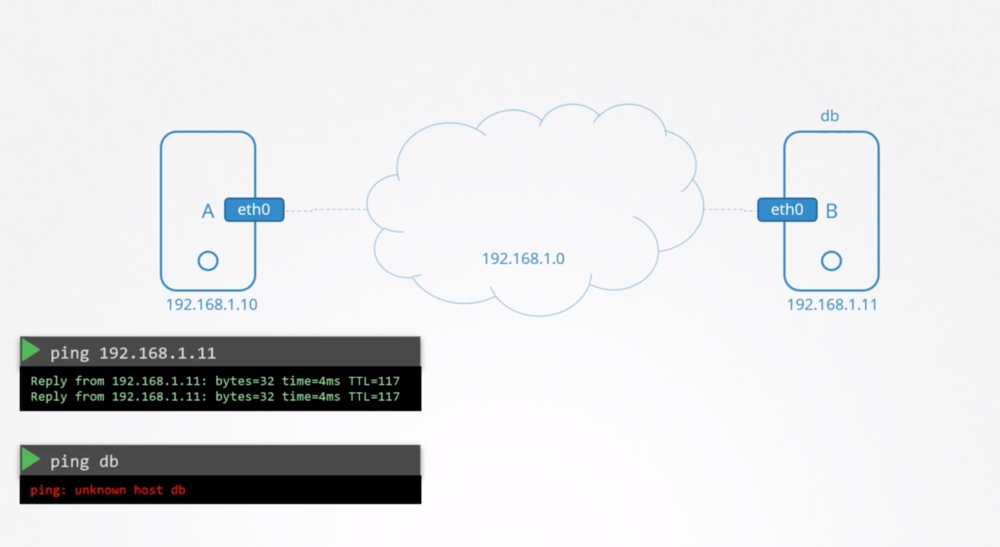
# Override hostname mapping to ip address
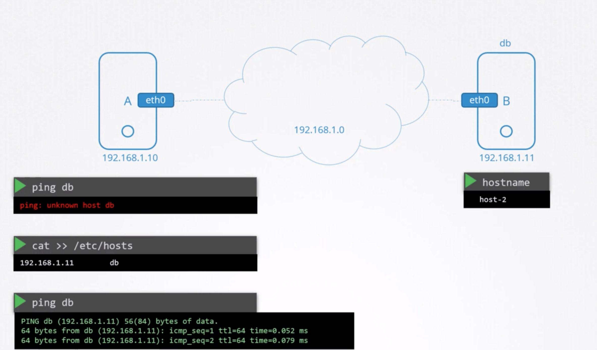
# Fool system by updating hostname
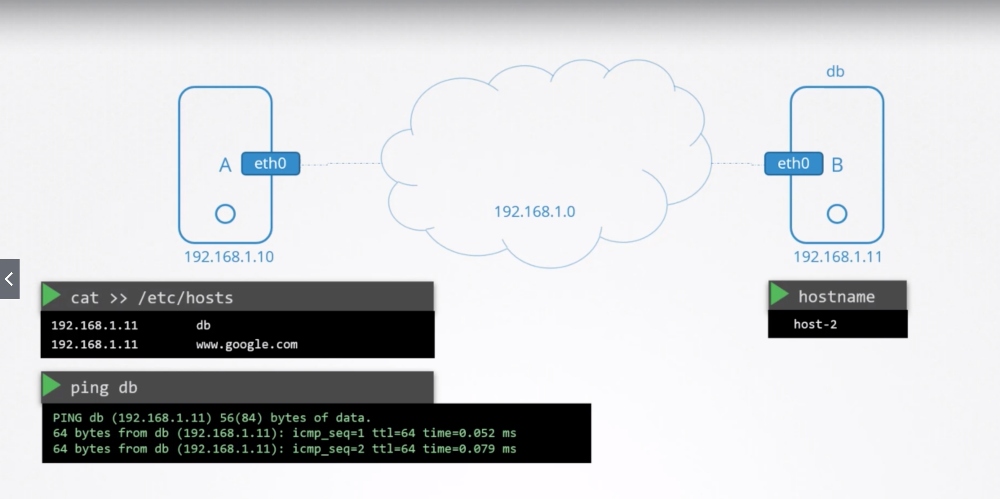
# Name resolution with small network
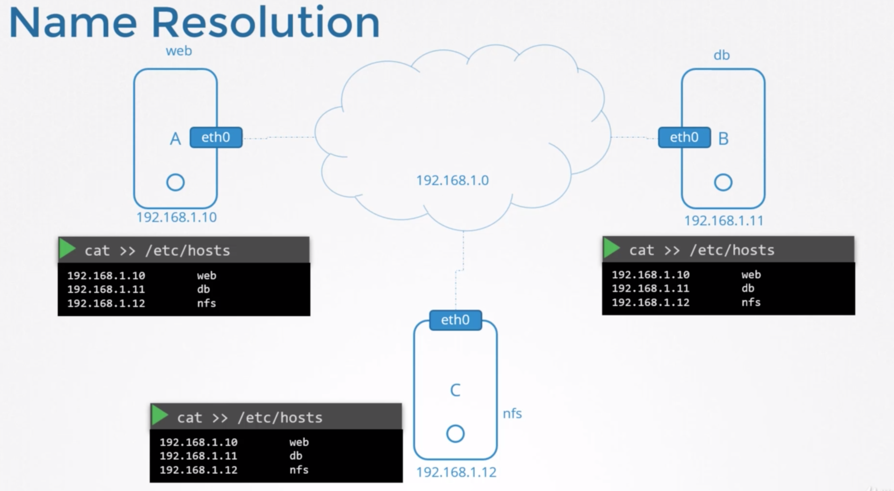
# Name resolution with large network
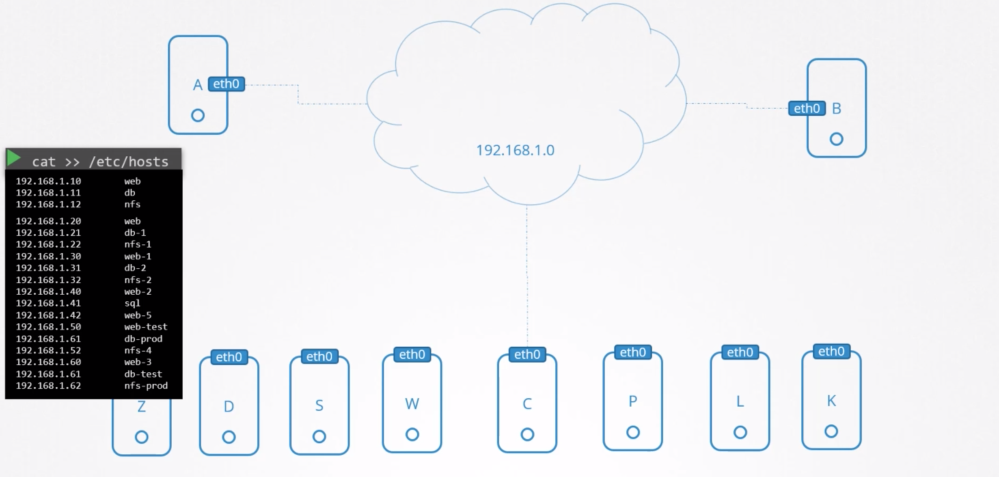
# DNS Server
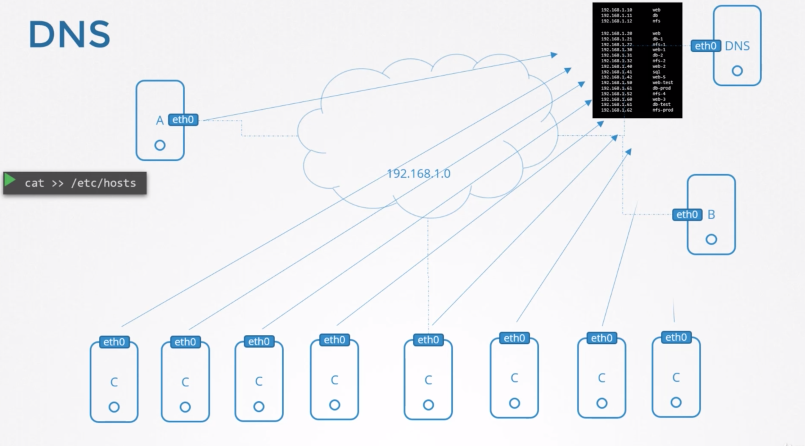
# DNS name server and hosts config
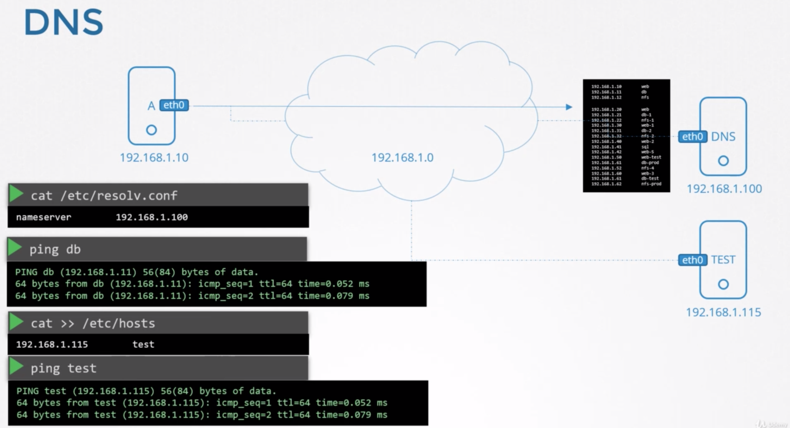
# Multiple nameservers for internet 
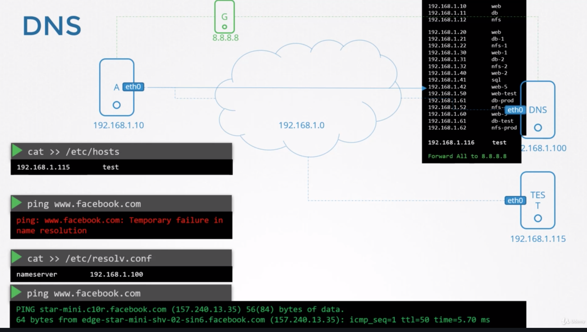
# Domain names
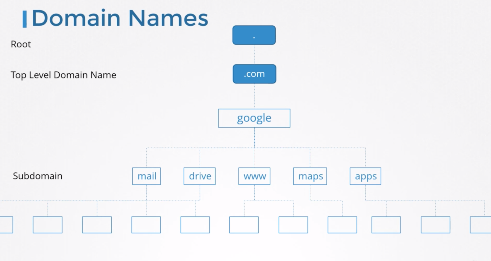
# DNS resolutions
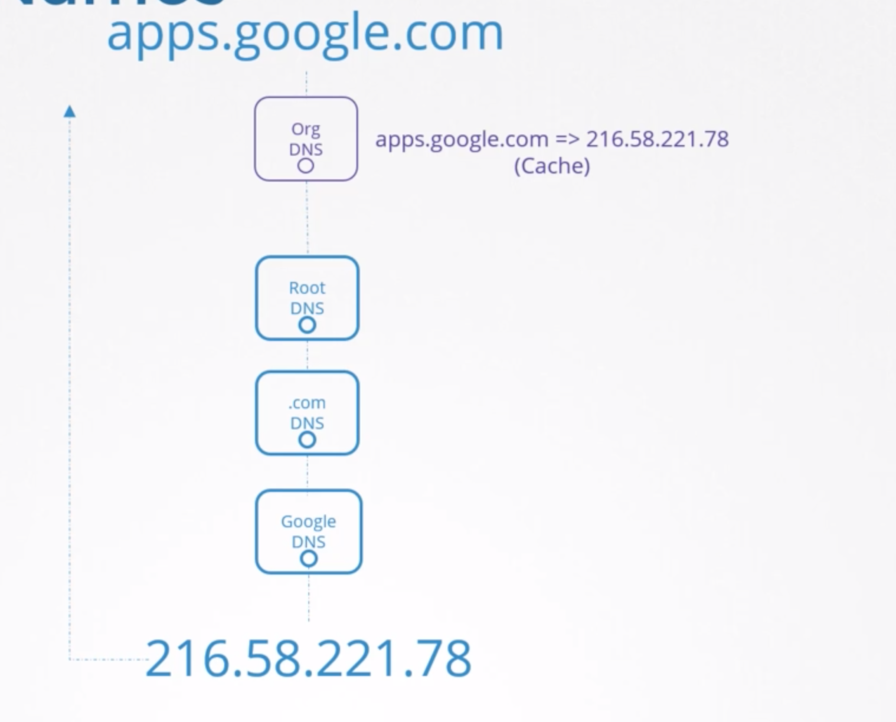

# Search domain for shortcut
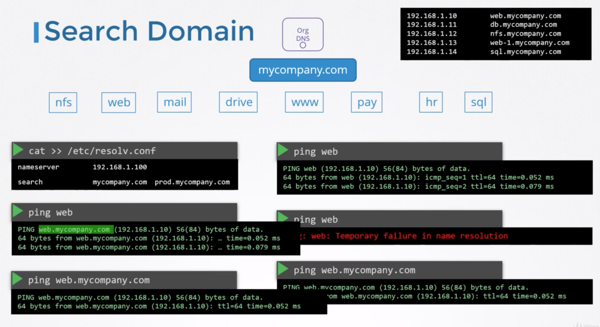
# Record Types
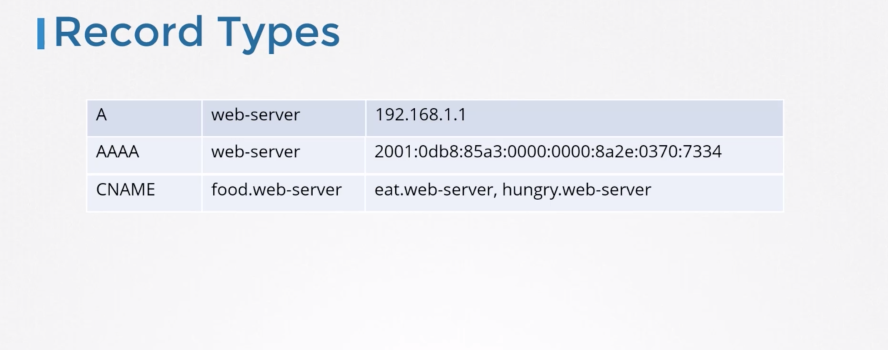
# nslookup
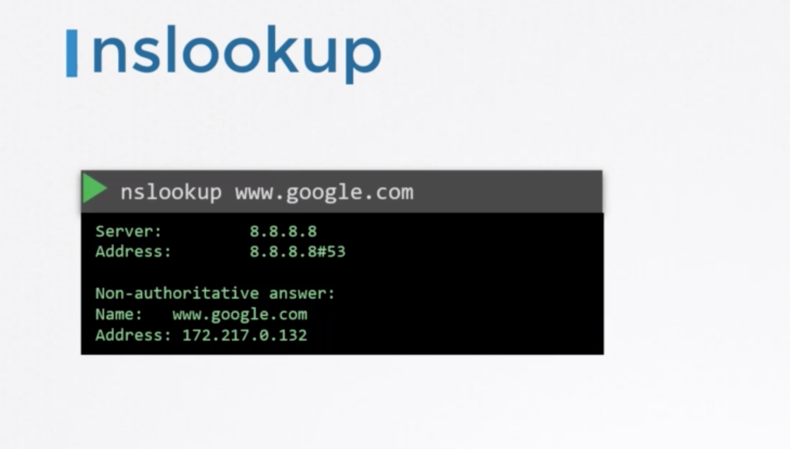
# dig
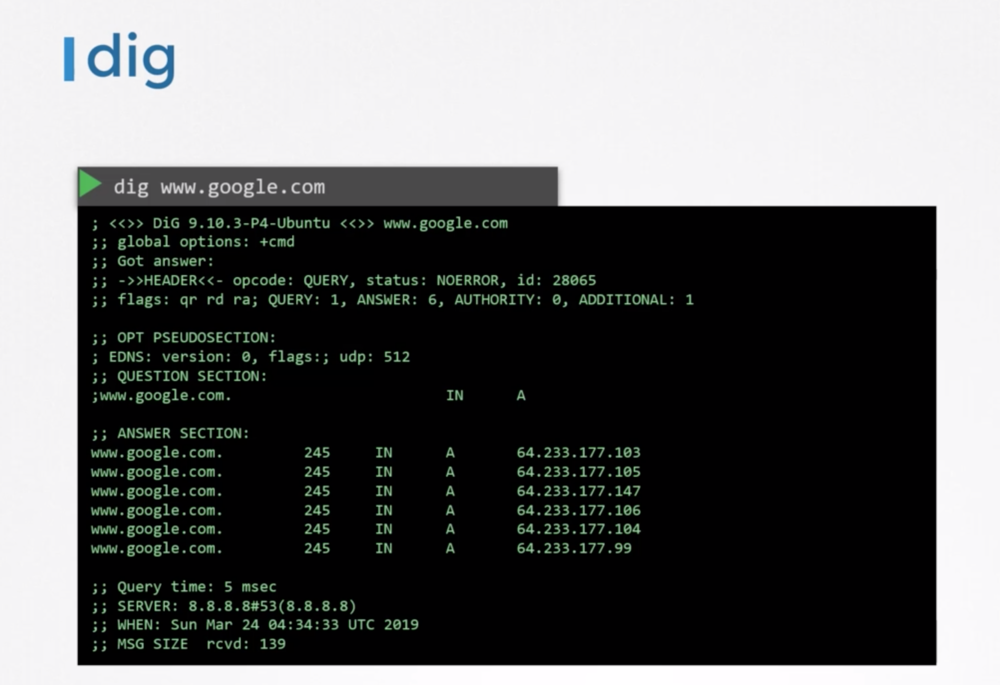
